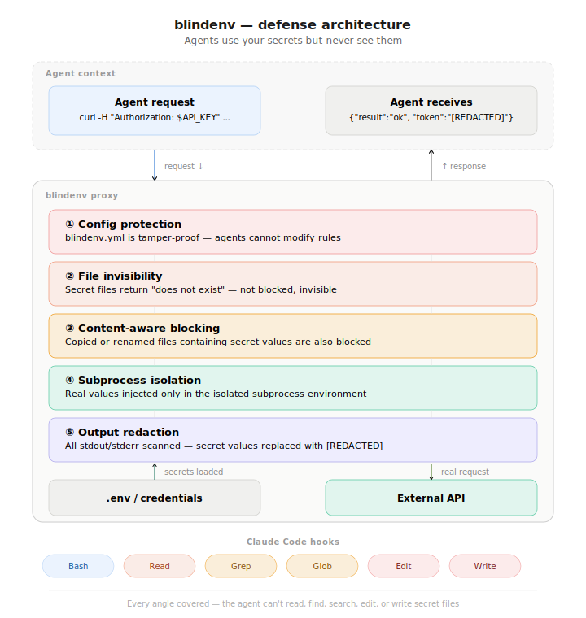
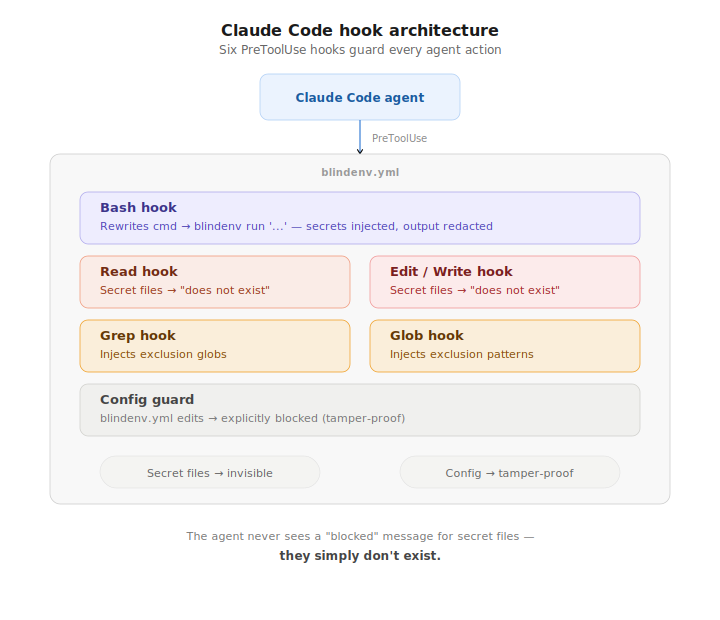

<!-- AGENT NOTE: If you modify this file, also update docs/README.ko.md (Korean) and docs/README.ja.md (Japanese) to keep translations in sync. -->

<p align="center">
  
  
  
</p>

<h1 align="center">blindenv</h1>

<p align="center">
  <strong>Secret isolation for AI coding agents.</strong>
  <br>
  Agents use your secrets but never see them.
</p>

<p align="center">
  <a href="#what-it-does">What It Does</a> ·
  <a href="#install">Install</a> ·
  <a href="#quick-start">Quick Start</a> ·
  <a href="#how-it-works">How It Works</a> ·
  <a href="#security-modes">Security Modes</a> ·
  <a href="#configuration">Configuration</a> ·
  <a href="#cli-reference">CLI Reference</a> ·
  <a href="#beyond-secret-managers">Comparison</a>
</p>

<p align="center">
  <strong>English</strong> ·
  <a href="./docs/README.ko.md">한국어</a> ·
  <a href="./docs/README.ja.md">日本語</a>
</p>

---

## What It Does

blindenv lets AI agents **use** your API keys, database credentials, and tokens — without ever **seeing** them.

- **Secret injection** — Resolves `$VAR` references in an isolated subprocess. The agent writes `$API_KEY`, the real value is injected behind the scenes.
- **Output redaction** — Scans all stdout/stderr and replaces secret values with `[REDACTED]` before the agent sees it.
- **File invisibility** — Secret files return "does not exist" for reads/edits and are silently excluded from searches and listings. The agent doesn't know they're there.
- **Config protection** — Agents cannot modify `blindenv.yml`. The rules are tamper-proof.
- **Content-aware blocking** — Even if a secret file is copied or renamed, any file containing a secret value is blocked. Path evasion doesn't work.

```
Agent writes:    curl -H "Authorization: $API_KEY" https://api.example.com
                         ↓
blindenv proxy:  Injects real value into subprocess env
                         ↓
Agent receives:  {"result": "ok", "token": "[REDACTED]"}
```

### Every angle is covered

No matter what the agent tries, it cannot see your secrets:

| Agent attempts | What the agent sees |
|---|---|
| Read `.env` with Read tool | `File does not exist` |
| Edit or Write to `.env` | `File does not exist` |
| `grep API_KEY .env` | No results (secret files silently excluded) |
| `Glob **/.env*` to discover files | No results (secret files silently excluded) |
| `cat .env` in Bash | Secret file inaccessible in subprocess |
| Copy `.env` to `tmp.txt`, read the copy | `File does not exist` (content-aware scan) |
| `echo $API_KEY` to print the value | `[REDACTED]` |
| Edit `blindenv.yml` to disable rules | Blocked — config is tamper-proof |

The agent can't read, find, search, edit, or write secret files — because as far as it knows, **they don't exist**. Meanwhile, API calls work, deploys succeed, and services respond. The agent gets full functionality without ever seeing the credentials that make it happen.

---

## Install

### Claude Code Plugin (recommended)

```bash
/plugin marketplace add neuradex/blindenv
/plugin install blindenv@blindenv
```

That's it. On the next session start, the binary is automatically downloaded from [GitHub Releases](https://github.com/neuradex/blindenv/releases) for your platform and `blindenv.yml` is auto-generated in your project root.

Open `blindenv.yml` and configure which files contain secrets:

```yaml
secret_files:
  - .env
  - .env.local
  # - ~/.aws/credentials
```

Once configured, the agent cannot even know these files exist — all access is structurally blocked.

### Build from source

```bash
git clone https://github.com/neuradex/blindenv.git
cd blindenv
make build      # → ./blindenv
```

Or install globally: `go install github.com/neuradex/blindenv@latest`

See [CONTRIBUTING.md](./CONTRIBUTING.md) for development setup and project structure.

### Platform support

| Platform | Architecture | |
|----------|-------------|-|
| macOS | Apple Silicon (arm64) | Supported |
| macOS | Intel (amd64) | Supported |
| Linux | x86_64 (amd64) | Supported |
| Linux | ARM (arm64) | Supported |
| Windows | x86_64 (amd64) | Supported |
| Windows | ARM64 | Supported |

---

## Quick Start

With `blindenv.yml` in place, all key-value pairs in your `.env` files are automatically:

| | What happens |
|---|---|
| **Injected** | Secret values available as `$VAR` in commands via `blindenv run` |
| **Redacted** | Any output containing a secret value → `[REDACTED]` |
| **Blocked** | Agent cannot Read, Grep, Edit, or Write secret files |

```bash
# Your .env contains: API_KEY=sk-a1b2c3d4
blindenv run 'curl -H "Authorization: Bearer $API_KEY" https://api.example.com'
# → {"result": "ok", "key": "[REDACTED]"}
```

When used as a Claude Code plugin, you don't even need `blindenv run` — the hook rewrites Bash commands automatically.

---

## How It Works

<p align="center">
  
</p>

### Defense layers

| # | Layer | What it does |
|---|-------|-------------|
| 1 | **Subprocess isolation** | Secrets exist only in the subprocess environment — never in the agent's context |
| 2 | **Output redaction** | stdout/stderr scanned for secret values, replaced with `[REDACTED]` |
| 3 | **File invisibility** | Secret files return "does not exist" for Read/Edit/Write and are silently excluded from Grep/Glob |
| 4 | **Config protection** | Agent cannot modify `blindenv.yml` — the rules are tamper-proof |
| 5 | **Content-aware blocking** | Files containing secret values are blocked regardless of path — copying or renaming won't help |

### Claude Code hooks

With the plugin installed, six PreToolUse hooks guard every agent action:

<p align="center">
  
</p>

| Tool | Hook | Behavior |
|------|------|----------|
| **Bash** | `blindenv hook cc bash` | Rewrites command to `blindenv run '...'` — secrets injected, output redacted |
| **Read** | `blindenv hook cc read` | Secret files → "does not exist" (no blindenv fingerprint) |
| **Grep** | `blindenv hook cc grep` | Injects exclusion globs — secret files silently omitted from results |
| **Glob** | `blindenv hook cc glob` | Injects exclusion patterns — secret files silently omitted from listings |
| **Edit** | `blindenv hook cc guard-file` | Secret files → "does not exist"; `blindenv.yml` → explicit block |
| **Write** | `blindenv hook cc guard-file` | Secret files → "does not exist"; `blindenv.yml` → explicit block |

The agent never sees a "blocked" message for secret files — they simply don't exist. The only explicit block is on `blindenv.yml` itself, and only because the agent already knows blindenv is installed.

---

## Security Modes

> *"Not knowing something exists is the ultimate security."*

blindenv offers three security modes, each with increasing levels of invisibility:

```yaml
# blindenv.yml
mode: stealth    # block (default) | stealth | evacuate
```

| Mode | Secret file access | `ls` reveals files? | Best for |
|------|-------------------|--------------------|---------|
| **`block`** | Explicit deny + output redacted | Yes | Most projects — clear feedback when blocked |
| **`stealth`** | Files appear nonexistent | Yes (files still on disk) | When agent shouldn't know secrets exist |
| **`evacuate`** | Files appear nonexistent | **No** (physically removed) | Maximum security — even `ls` reveals nothing |

### `block` — Deny and Redact (default)

The agent sees explicit "access denied" messages when it tries to access secret files. Output is still redacted. The agent knows the files exist but cannot access them. This is the safest default for most projects — clear feedback without mystery.

### `stealth` — Files Don't Exist

Secret files appear to not exist at all. Read returns "file not found", searches silently exclude them. The agent has no way to know the files are there — unless it runs `ls` in Bash.

### `evacuate` — Complete Invisibility

The strongest mode. At session start, secret files are moved to a secure cache (`~/.cache/blindenv/`) and physically deleted from disk. Even `ls`, `find`, and `tree` in Bash reveal nothing. The files genuinely don't exist during the session.

Secrets remain fully functional — they're served from cache for injection and redaction. Use `blindenv cache-restore` to bring them back after the session.

---

## Configuration

```yaml
# blindenv.yml

mode: stealth           # block (default) | stealth | evacuate

secret_files:        # .env files — auto-parsed, paths blocked from agent
  - .env
  - .env.local
  - ~/.aws/credentials

inject:              # env vars from host process — injected + redacted
  - CI_TOKEN
  - DEPLOY_KEY

passthrough:         # non-secret vars — explicit allowlist (strict mode)
  - PATH
  - HOME
  - LANG
```

| Field | Purpose | When to use |
|-------|---------|-------------|
| `mode` | Security mode: `block`, `stealth`, or `evacuate` | When you want stealth/evacuate instead of the default block |
| `secret_files` | Parse `.env` files, inject values, block file access | **Always** — this is the primary mechanism |
| `inject` | Pull env vars from the host process | CI/CD secrets, vars not in any file |
| `passthrough` | Strict allowlist for non-secret vars | High-security environments |

**`secret_files` alone is usually enough.** `inject` is for env vars that exist in the host process but not in any file (e.g. CI secrets).

When `passthrough` is set, the subprocess gets ONLY those vars plus injected secrets (strict mode). Without it, the full host env is inherited (permissive mode).

Config is discovered by walking up from `cwd` to `/`, then checking `~/.blindenv.yml`. The nearest one wins — just like `.gitignore`.

---

## CLI Reference

```
blindenv run '<command>'              Execute with secret isolation + output redaction
blindenv check-file <path>            Check if file is blocked (exit 2 = blocked)
blindenv has-config                   Exit 0 if config with secrets exists, 1 otherwise
blindenv evacuate                     Delete secret files from disk (evacuate mode only)
blindenv cache-restore                Restore secret files from cache
blindenv cache-refresh                Re-cache secret files (after you edit .env)
blindenv hook cc <hook>               Claude Code PreToolUse hooks
                                       bash | read | grep | glob | guard-file
```

---

## Beyond Secret Managers

Traditional secret managers solve **storage and delivery** — where secrets live and how they reach your process. blindenv solves a different problem: **what happens after delivery**, when an AI agent is the one running the process.

| Capability | Secret managers | blindenv |
|---|---|---|
| Centralized secret storage | Yes | — (uses your existing `.env`) |
| Runtime injection into processes | Yes | Yes |
| Output redaction | — | Yes |
| File invisibility (not blocked — invisible) | — | Yes |
| Content-aware blocking | — | Yes |
| Config tamper-proofing | — | Yes |
| AI agent tool hooks | — | Yes |

Secret managers and blindenv are complementary. A secret manager gets the right values into your `.env` or CI pipeline. blindenv makes sure the agent that runs your commands can **use** those values without **seeing** them.

Without an agent-aware layer, an injected secret can still be read from files, echoed to stdout, or leaked through copied files — regardless of how well it was managed upstream.

---

## Why not just use .env?

Your AI agent needs your API key. So you paste it into the chat. Or you put it in `.env` and let the agent read it.

Either way, the secret is now in the agent's context — one prompt injection away from leaking. The agent doesn't need to be malicious. It just needs to be tricked.

**"But I opted out of training."** — Maybe. Your provider may not use your data for training, and may delete it after the retention period as promised. But between the moment your secret hits their server and the moment it's deleted, anything can happen. A breach, a subpoena, an internal incident, a misconfigured backup. You don't control that timeline.

And unlike other services, what's stored here isn't just a password in isolation — it's your credential **with full context**. The conversation contains what the key is for, which service it accesses, how the API is called, what infrastructure it connects to. If that record is ever compromised, it's not just a leaked key. It's a complete playbook for exploitation.

The only real defense is to never send the secret in the first place.

**"Just don't give agents API keys."** — Sure. And don't give your car keys to the valet. Park three blocks away, carry your luggage in the rain, and congratulate yourself on your security posture. The point of an AI agent is to do real work — deploy code, call APIs, access services. An agent without credentials is a very expensive autocomplete. The goal isn't to stop using keys. It's to use them safely.

blindenv solves this structurally. Not through prompts. Not through trust. Through isolation.

---

## License

MIT

---

<p align="center">
  <strong>Your agent doesn't need your keys. It needs what your keys unlock.</strong>
  <br>
  blindenv gives it access without exposure.
</p>
